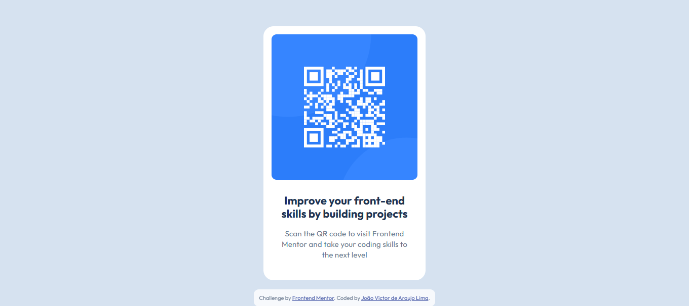

# Frontend Mentor - QR code component solution

## Languages
This first section is in English. 

[Versão em português logo abaixo.](#portuguese)

## Context

This is a solution to the [QR code component challenge on Frontend Mentor](https://www.frontendmentor.io/challenges/qr-code-component-iux_sIO_H). Frontend Mentor challenges help you improve your coding skills by building realistic projects.

> Your challenge is to build out this QR code component and get it looking as close to the design as possible.

## Table of contents

- [Overview](#overview)
  - [Screenshot](#screenshot)
  - [Links](#links)
- [My process](#my-process)
  - [Built with](#built-with)
  - [What I learned](#what-i-learned)
- [Author](#author)

## Overview

### Screenshot

<p align="center">
  
</p>

### Links

- Solution URL: [GitHub Repository](https://github.com/xuaun/qr-code-component)
- Live Site URL: [Live Page](https://xuaun.github.io/qr-code-component/)

## My process

### Built with

- Semantic HTML5 markup
- CSS custom properties
- Flexbox

### What I learned

In this project I was able to use flexbox and variable concepts in CSS, as well as using a ready-made Figma design to create this component.

```css
:root {
  /* COLORS */
  --background-body-color: hsl(212, 45%, 89%);
  --background-card-color: hsl(0, 0%, 100%);
  --title-color: hsl(218, 44%, 22%);
  --text-color: hsl(216, 15%, 48%);
  
  /* More CSS code */
}
```

## Author

- Website - [João Víctor de Araujo Lima's Portfolio](https://xuaun.github.io/)
- Frontend Mentor - [@xuaun](https://www.frontendmentor.io/profile/xuaun)

____
<br>

# <p id="portuguese">Frontend Mentor - Solução do projeto do componente QR code</p>

## Contexto

Esta é uma solução para o [desafio do componente de código QR no Frontend Mentor](https://www.frontendmentor.io/challenges/qr-code-component-iux_sIO_H). Os desafios do Frontend Mentor ajudam você a melhorar suas habilidades de codificação construindo projetos realistas.

> Seu desafio é criar esse componente de QR code e fazer com que ele tenha a aparência mais próxima possível do design.

## Lista de conteúdos

- [Visão Geral](#visão-geral)
  - [Print](#prints)
  - [Links](#links-pt)
- [Meu processo](#meu-processo)
  - [Tecnologias utilizadas](#tecnologias-utilizadas)
  - [O que eu aprendi](#o-que-eu-aprendi)
- [Autor](#autor)

## Visão Geral

### Print

<p align="center">
  
</p>

### <p id="links-pt">Links</p>

- Link da solução: [Repositório no GitHub](https://github.com/xuaun/qr-code-component)
- Site com a solução: [Página no ar](https://xuaun.github.io/qr-code-component/)

## Meu processo

### Tecnologias utilizadas

- HTML5
- CSS
- Flexbox

### O que eu aprendi

Neste projeto eu pude utilizar conceitos de flexbox e de variáveis no CSS, além de usar um design pronto do Figma para a elaboração deste componente.

```css
:root {
  /* COLORS */
  --background-body-color: hsl(212, 45%, 89%);
  --background-card-color: hsl(0, 0%, 100%);
  --title-color: hsl(218, 44%, 22%);
  --text-color: hsl(216, 15%, 48%);
  
  /* More CSS code */
}
```

## Autor

- Website - [Portfólio - João Víctor de Araujo Lima](https://xuaun.github.io/)
- Frontend Mentor - [@xuaun](https://www.frontendmentor.io/profile/xuaun)